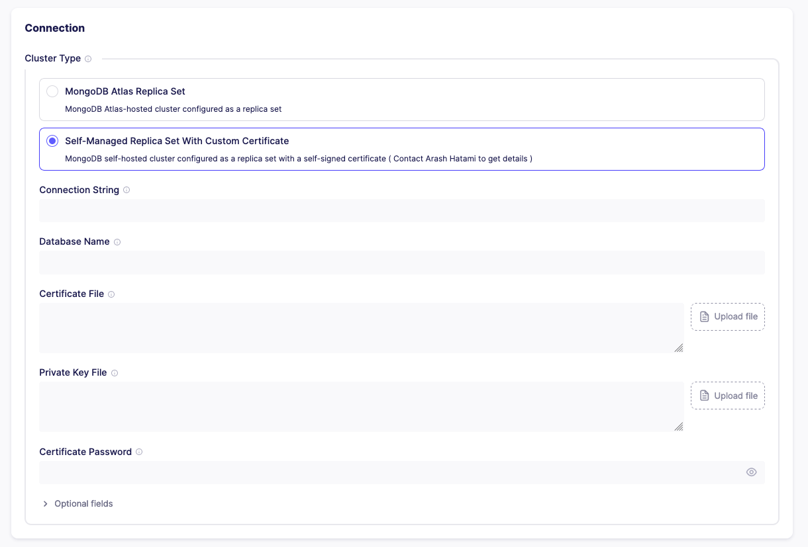

# Airbyte Connector Source MongoDB v2 - Custom SSL

This is the repository for the MongoDB v2 source connector in Java. The [default version](https://docs.airbyte.io/integrations/sources/mongodb-v2) of this connector has SSL enabled by default and need a valid certificate to connect to the MongoDB instance. This version of the connector allows to upload a custom certificate to connect to the MongoDB instance with a self-signed certificate.

## Prerequisites

- JDK 17
- Gradle 7.6

## How-to

- Go to `Settings > Sources` in Airbyte UI and create a new connector
- Select `Add a new Docker connector`
- Use this Docker image `hatamiarash7/airbyte-source-mongodb-v2-custom-ssl:v1.0.0`
- Go to `Sources > New sources` and select your custom connector

Fill the form with your MongoDB connection details and upload your certificate file.

1. `Connection String`: The MongoDB connection string. Example: `mongodb://localhost:27017`
2. `Database Name`: The database name to connect to. Example: `local`
3. `Certificate File`: The certificate file to connect to the MongoDB instance with a self-signed certificate. Example: `mongodb.pem`. You can use the `Upload` button to upload your certificate file or paste the content of the certificate file in the text area.
4. `Private Key File`: The private key file of your certificate. Example: `mongodb.key`. You can use the `Upload` button to upload your private key file or paste the content of the private key file in the text area.
5. `Certificate Password`: The password of your certificate.

---

## Support 💛

 

## Contributing 🤝

Don't be shy and reach out to us if you want to contribute 😉

1. Fork it!
2. Create your feature branch: `git checkout -b my-new-feature`
3. Commit your changes: `git commit -am 'Add some feature'`
4. Push to the branch: `git push origin my-new-feature`
5. Submit a pull request

## Issues

Each project may have many problems. Contributing to the better development of this project by reporting them. 👍
